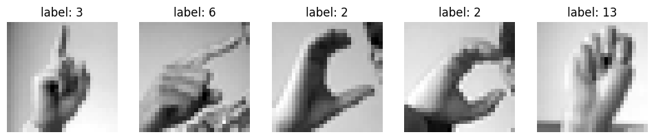
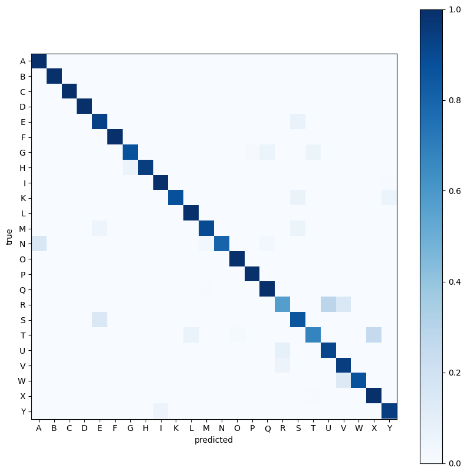
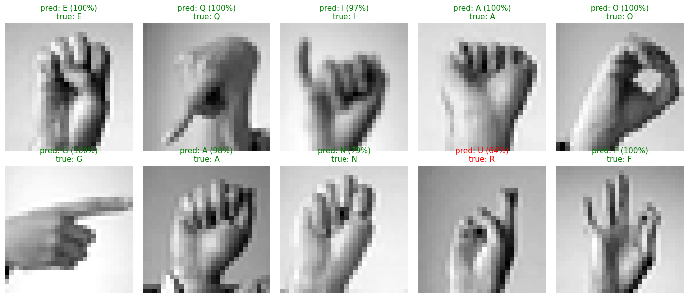

# Sign Language Letter Recognition (CNN)

A convolutional neural network trained from scratch to classify American Sign Language letters from 28×28 greyscale images.

**92.8% accuracy on the held-out test set.** The error analysis is the more substantive result: the misclassifications are not randomly distributed, and the confusion matrix shows they cluster on physically near-identical handshapes.

---

## Task

Take a 28×28 greyscale photo of a hand making an ASL letter and predict which of 24 letters it is.

The task covers 24 letters rather than 26 because **J and Z require motion** and cannot be represented in a single still image. The dataset excludes them.

## Dataset

[Sign Language MNIST](https://www.kaggle.com/datasets/datamunge/sign-language-mnist) (Kaggle).

| Split | Images |
|---|---|
| Training | 21,964 |
| Validation | 5,491 |
| Test | 7,172 |

Each row is 785 values: one label plus 784 pixels (28 × 28 flattened).



Both images labelled `2` show a hand curved into a C shape, confirming that labels correspond correctly to the images.

## Preprocessing

1. **Scaled** pixels from 0–255 to 0–1 (cast to `float32` first).
2. **Reshaped** flat rows of 784 into `(28, 28, 1)`: height, width, channel.
3. **Remapped the labels.** The dataset's label values skip 9 (J is absent) and run to 24, so the 24 classes present are not a clean 0–23 range. A lookup closes the gap before one-hot encoding, so the values line up with the 24 output neurons.
4. **Split** 20% off for validation, stratified by letter so both halves keep the same class proportions.

## Architecture

| Layer | Output shape | Params |
|---|---|---|
| Conv2D(32, 3×3) + ReLU | 26 × 26 × 32 | 320 |
| MaxPooling2D(2×2) | 13 × 13 × 32 | 0 |
| Conv2D(64, 3×3) + ReLU | 11 × 11 × 64 | 18,496 |
| MaxPooling2D(2×2) | 5 × 5 × 64 | 0 |
| Flatten | 1600 | 0 |
| Dense(128) + ReLU | 128 | 204,928 |
| Dropout(0.5) | 128 | 0 |
| Dense(24, softmax) | 24 | 3,096 |

**226,840 trainable parameters.** Optimizer `adam`, loss `categorical_crossentropy`, 10 epochs, batch size 64.

The majority of parameters reside in the dense layer. Convolutional filters are comparatively inexpensive because each reuses the same nine weights at every spatial position.

---

## Results

| Metric | Value |
|---|---|
| Final training accuracy | 96.9% |
| Final validation accuracy | 99.96% |
| **Test accuracy** | **92.8%** (loss 0.2490) |

Validation accuracy is higher than training accuracy and close to perfect, while test accuracy is seven points lower. This pattern indicates that the validation figure does not reflect genuine generalisation and should not be reported as the result.

**Sign Language MNIST is augmented from a much smaller set of original photographs.** According to the dataset documentation, it was built by extending 1,704 uncropped colour images: an ImageMagick pipeline cropped them to the hand region, converted them to greyscale, resized them to 28x28, and generated 50+ variations of each using resampling filters, 5% random pixelation, plus or minus 15% brightness and contrast, and 3 degrees of rotation.

A random train/validation split therefore places near-duplicates of the same source photograph on both sides, and validation ends up testing on images the model has effectively already seen. This is data leakage into the validation set.

The test set is a separate file that was not used at any point during training, so **92.8% is the figure reported here.**

## Error Analysis

92.8% means 514 test images misclassified. A single accuracy figure does not indicate which images failed or why, so a confusion matrix was constructed.



An initial version of this plot used raw counts, which proved misleading. The test set is unbalanced (E has 498 images, R has 144), so shade tracked class size rather than accuracy. Normalising each row by its own total corrects this, so shade represents accuracy and is comparable across letters.

**Per-letter accuracy ranged from 56.9% to 100%.** Eight letters were classified perfectly (A, B, C, D, F, L, O, P). The weakest were R at 56.9%, T at 67.3%, and N at 79.7%.

### Top Confusions

| Count | True → Predicted | | Count | True → Predicted |
|---|---|---|---|---|
| 62 | T → X | | 23 | H → G |
| 44 | N → A | | 22 | U → R |
| 41 | R → U | | 21 | R → V |
| 35 | S → E | | 21 | M → S |
| 35 | E → S | | 21 | K → S |
| 27 | W → V | | 21 | G → Q |

These confusions fall into four groups, verified against the ASL alphabet chart:

- **Closed fists differing only in thumb position:** N→A, M→S, K→S. A, M, N, S, T and E are all formed as a closed fist, and at 28×28 resolution the thumb occupies only a few pixels.
- **Thumb position obscured by resolution:** T→X at 62, the single largest confusion. The T handshape places the thumb between the fingers, a detail largely lost at 28×28.
- **Two-finger shapes:** R→U, U→R, R→V, W→V. R, U and V are distinguished only by whether two fingers are together, crossed, or spread.
- **Same handshape, different orientation:** G→Q. G points sideways and Q points downward. Pooling introduces tolerance to small spatial shifts, which benefits classification generally but reduces accuracy where orientation is the only distinguishing feature.

Several confusions are **mutual**: S→E and E→S at 35 each, R→U at 41 alongside U→R at 22. Bidirectional confusion indicates that these shapes are genuinely ambiguous at this resolution, rather than reflecting a bias toward one letter.

### Sample Predictions



Ten random test images with the predicted letter, its confidence, and the true label. Nine were correct, six of them at 100% confidence and the remaining three at 97%, 98% and 79%. The single error was R predicted as U at 64%, the lowest confidence in the sample. R→U is also the third most frequent confusion across the full test set.

---

## Known Limitations

- **The model does not generalise to unconstrained photographs.** Training data consists of tightly cropped 28×28 greyscale images with a narrow distribution of lighting, framing and skin tone. Arbitrary images sourced online are misclassified, as demonstrated by the notebook's upload-and-predict cell. This reflects a distribution mismatch rather than a defect in the architecture.
- **Results vary between training runs.** Weight initialisation is not seeded, so retraining shifts the reported figures by approximately half a percentage point and alters the ranking of the weakest letters. All figures in this document correspond to the run saved in the notebook.
- **Validation accuracy is not a meaningful metric on this dataset,** for the leakage reason described above. Only the test figure should be cited.
- **Static letters only.** J and Z are excluded by the dataset.
- **Confidence calibration has not been measured.** The single low-confidence error in the sample above is suggestive but does not constitute evidence. Establishing that the model is reliably less certain when incorrect would require analysing confidence across all 514 misclassifications.

## Future Work

1. **Seed the run** (`random`, `numpy`, `tensorflow`) so results are reproducible.
2. **Higher-resolution inputs.** Nearly all errors depend on features only a few pixels wide, such as thumb position or the gap between fingers. 28×28 greyscale cannot represent that detail, making input resolution a higher priority than architectural changes.
3. **Rotation and shift augmentation**, targeting the orientation-only confusions such as G/Q.
4. **A train/validation split grouped by source photograph,** so augmented near-duplicates cannot cross the boundary and validation accuracy becomes meaningful.
5. **Confidence calibration analysis** across the full error set, to determine whether low confidence reliably predicts misclassification.

---

## Reproducing the Results

The notebook is written for Google Colab and reads the dataset CSVs from Google Drive.

```bash
pip install -r requirements.txt
```

1. Download the dataset from [Kaggle](https://www.kaggle.com/datasets/datamunge/sign-language-mnist).
2. Place `sign_mnist_train.csv` and `sign_mnist_test.csv` where the notebook expects them, or update the paths in the first cell.
3. Run `Sign_Language_Recognizer.ipynb` from top to bottom. Training completes in a few minutes on a Colab CPU.

## Technologies Used

Python · TensorFlow / Keras · scikit-learn · NumPy · pandas · matplotlib · Pillow
